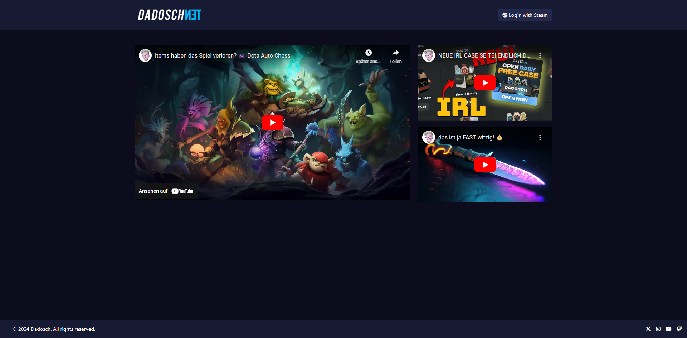
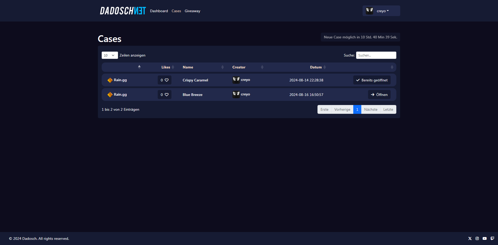
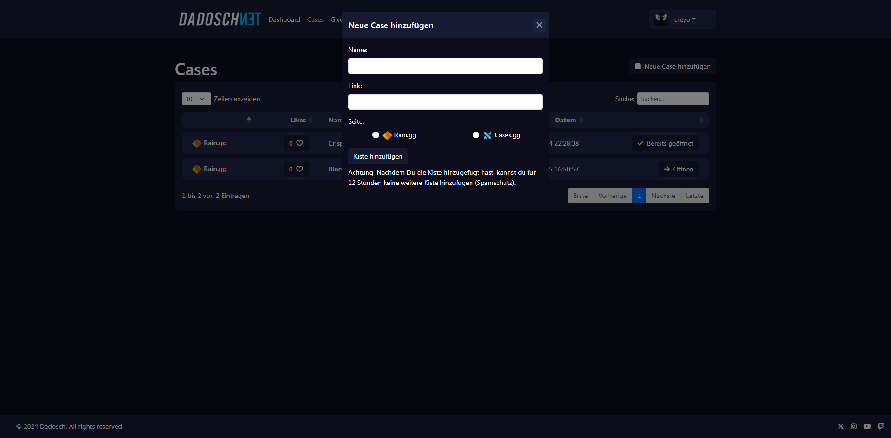
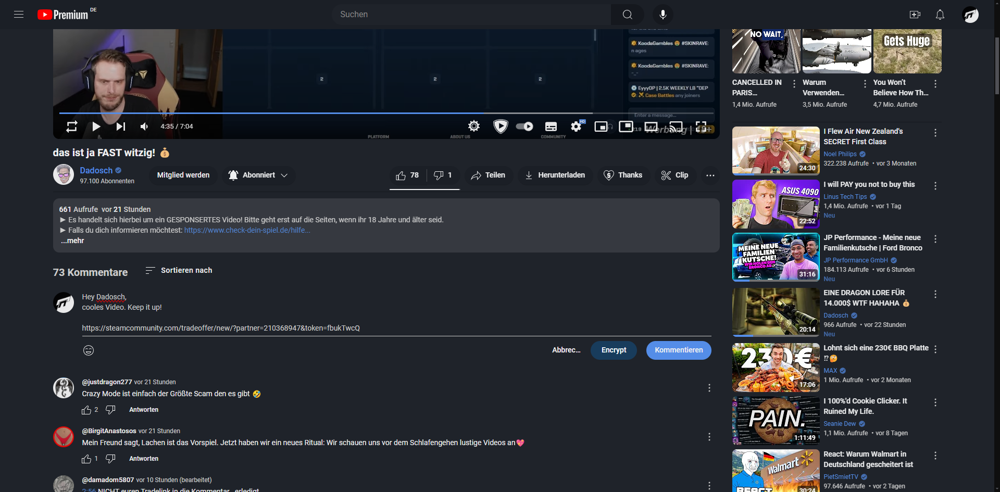
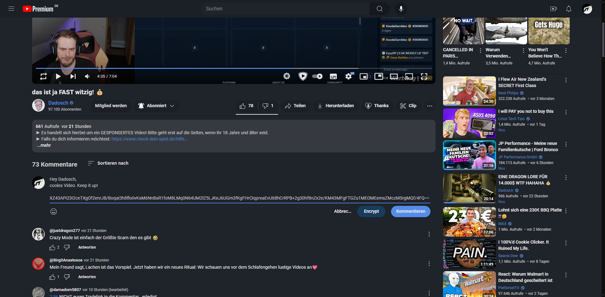
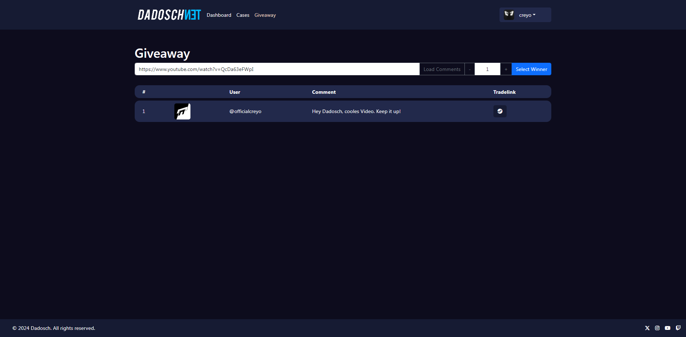
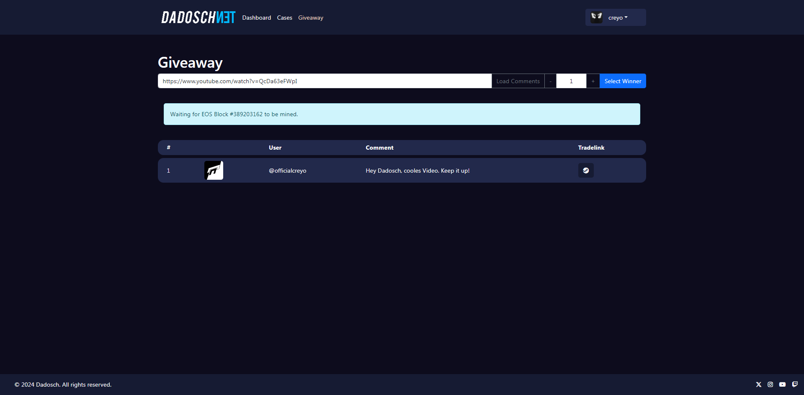
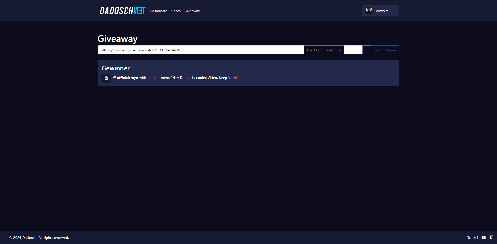

# Dnet Preview

## Front Page

## Cases Page

## Giveaway Tool
Ein Giveaway Tool welches in Verbindung mit Chrome/Firefox funktioniert. Der Tradelink wird dabei im Kommentarfeld mit dem Klick auf "Encrypt" (links neben dem Kommentierfeld) durch eine RSA-DCD Verschlüsselung encrypted.
Herauskommt eine nicht lesbare Zeichenkette.

Diese Kommentare können im Webinterface ausgelesen werden. Es werden dann alle Kommentare mit einem encrypteten Tradelink herausgefiltert und der Tradelink kann über den Knopfdruck geöffnet werden.
Außerdem gibt es eine Giveaway Option über der man einen oder mehrere Gewinner auslesen kann. Das Auslesen erfolgt dabei über einen EOS Hash vom nächsten geminten Block.

Es kann nur einmal pro Video ein Giveaway gestartet werden. Die Ergebnisse über die Raffles werden in einer Datenbank gespeichert, sodass sie von jedem eingesehen werden können.

